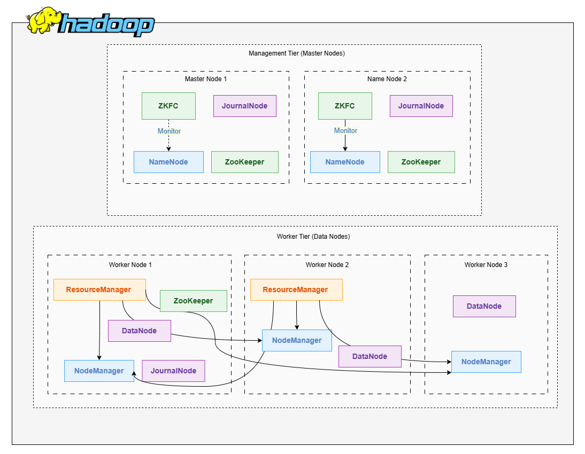

# HA Hadoop Cluster on Docker

A fully containerized **High Availability (HA) Hadoop cluster** running on Docker with 5 nodes, featuring HDFS HA, YARN HA, and ZooKeeper quorum for automatic failover.

## 📋 Architecture Overview

### Node Configuration

| Node | Hostname | Services |
|------|----------|----------|
| **Node1** | `nn1` | • NameNode (Active/Standby) • JournalNode • ZooKeeper • ZKFC |
| **Node2** | `nn2` | • NameNode (Active/Standby) • JournalNode • ZooKeeper • ZKFC |
| **Node3** | `datanode1` | • DataNode • JournalNode • ResourceManager (Active/Standby) • ZooKeeper • NodeManager |
| **Node4** | `datanode2` | • DataNode • ResourceManager (Active/Standby) • NodeManager |
| **Node5** | `datanode3` | • DataNode • NodeManager |

### Key Design Decisions

- **JournalNodes distributed** across nodes 1,2,3 ensures quorum (2/3) can be maintained even if 1 fails
- **ZooKeeper on 3 nodes** (1,2,3) provides quorum for both HDFS and YARN failover
- **ResourceManagers on nodes 3 and 4** are separate from ZooKeeper quorum to avoid single point of failure
- **ZKFC runs on NameNode hosts** as required by Hadoop documentation
